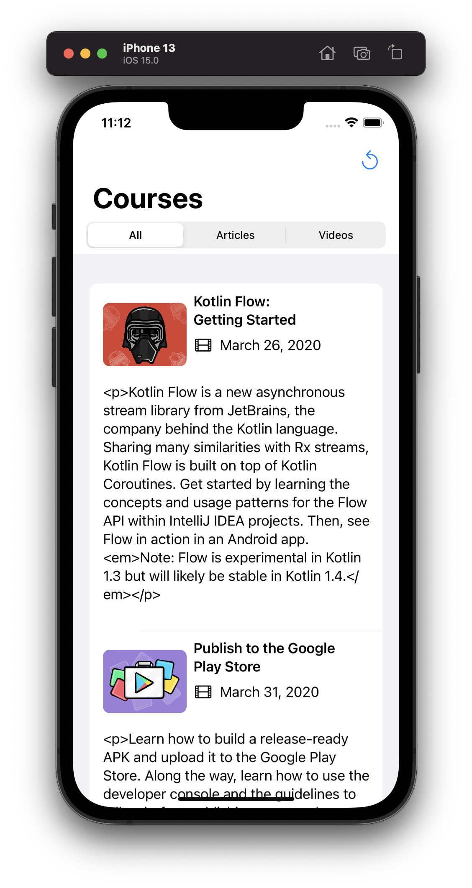
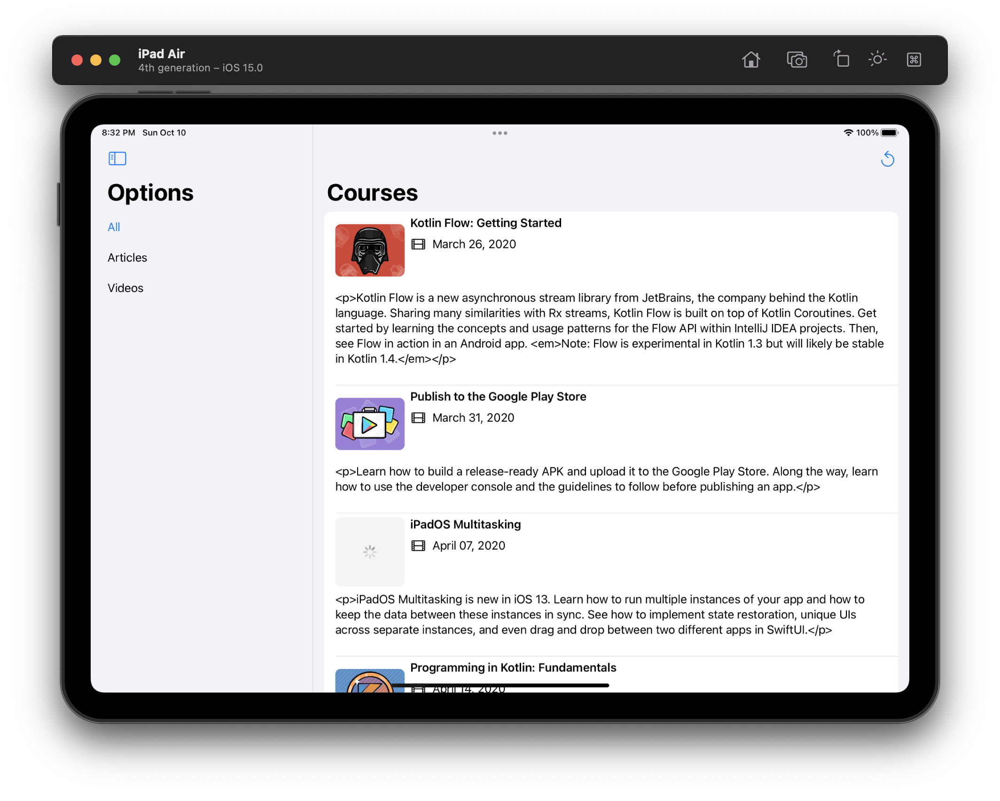
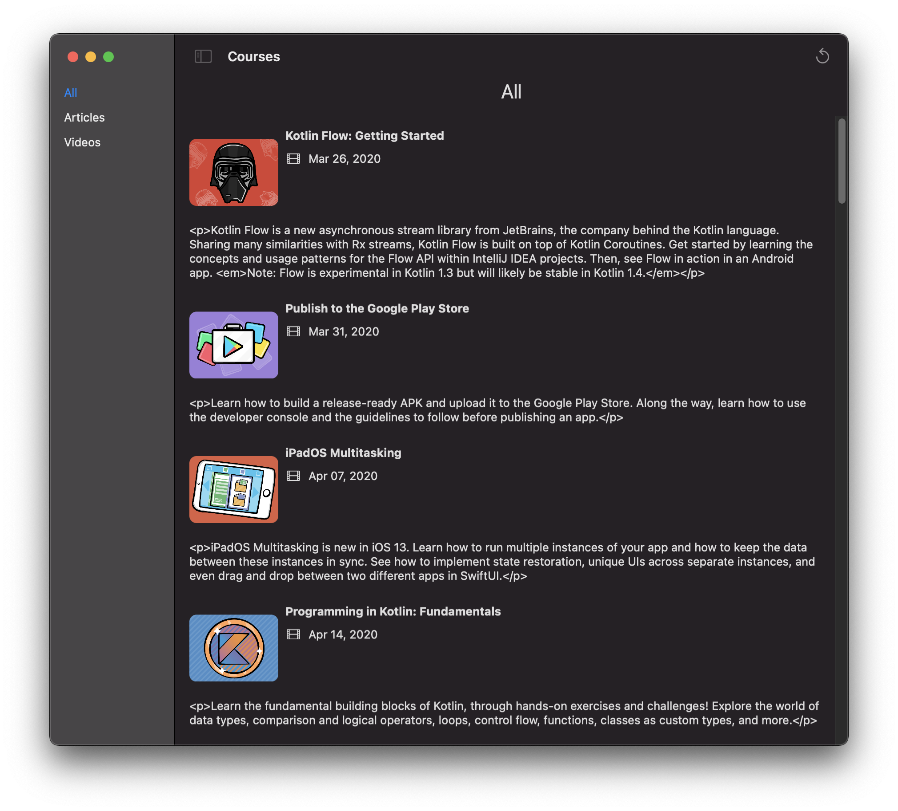

# README

This project is based off of the example project at https://github.com/raywenderlich/ios-interview/tree/master/Practical%20Example

## Requirements

To pass the test, the app has to include the following:
* Fetch articles and video courses and display them once both networking calls have finished. 
* For each item (article or video course) you have to display **at least**:
	* Name
	* Artwork
	* Description
	* Type (article or video)
* The results should be sorted by release date.
* There should be a way to view:
	* Only articles
	* Only videos
	* Both

### Fetch Articles

I used combine for the networking calls, and chained them together using `combineLatest` that way they only deliver the results if they are both successful.

### Models

I limited the amount of information used by the models. The app displays the name, the artwork, the description and the type (this is shown using an image).

### Sorted

The articles and videos are both sorted by their `released_at` dates. The combined list is sorted together and so that the articles and videos appear mixed together.

### View

In the iPhone application a segmented control is used to allow the user to toggle between the three sections. 

In the iPad and Mac versions, a collapsible sidebar is used to house the option to toggle between the three sections.

---

## Installation Instructions

Clone the repo from `https://github.com/andrewmarmion/PracticalExample.git`

Built using Xcode 13 on a Mac with macOS 11.6.

The application uses no external dependencies. 

## Application

This is a multi-platform project containing distinct layouts for iOS, iPadOS, and macOS.

## Structure

Rather than litter the code with OS availability checks, for some files, I chose to have iOS and macOS versions. This means that although there are duplicate files they are consigned to specific targets. It makes the code, in my opinion, easier to read. 

Where possible I have tried to reuse views across platforms, this is to limit duplication. 

The majority of the logic for the application is contained within the `ViewModel`, and this is passed through the view hierarchy by using `environmentObject`.

## Tests

The tests were built in a macOS target, however there exists an iOS target that contains the same test files. Tests can be run on either platform. 

There are no UI tests or snapshot tests. But these could be added.

---

## TODO

- Handle the html text in the description of the videos.json.
- Add cache for images.
- Add cache/storage for json responses.
- Write some UI tests, either by snapshot or by XCUITest.